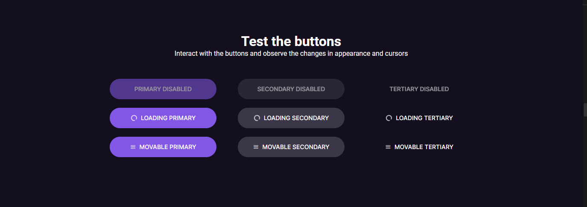

# Angular 17 Button Design System project

## Overview

This project is a button design system developed using Angular 17 and Sass. It includes a collection of reusable button components styled using Sass variables to ensure consistency and flexibility.

## Features

I used modularized button components for easy integration and customization.
I Utilized Angular 17's features such as property binding for dynamic behavior.
Styled with Sass, allowing for easy customization through variables of colors.
Responsive design for good user experience across devices.

## Contributing
Contributions are welcome! If you note an error or have suggestions for improvement, please submit a pull request or email me.

## License
This project is licensed under the MIT License - see the LICENSE file for details.

